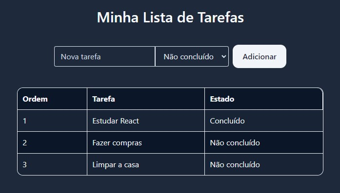

# Lista de tarefas

Lista de tarefas customizável, responsível e com save local feita em React e Tailwind, futuramente salvará em banco de dados.

- https://github.com/mauricioraupp/reactTailwindProject



## Iniciando

Essas instruções permitirão que você obtenha uma cópia do projeto em operação na sua máquina local para fins de desenvolvimento e teste.

Esse projeto pode ser executado usando npm.

O npm é um instância do Node.js, o que significa que se você baixar Node.js, o npm vem junto automaticamente. [Download Node.js](https://nodejs.org/en/download/package-manager)

## Como Instalar

- Para baixar o projeto siga as instruções abaixo:

```
1. git clone https://github.com/mauricioraupp/reactTailwindProject.git
2. cd reactTailwindProject
```

- Instale as dependências:

```
npm install
```

- Execute o servidor frontend

```
npm run start
```

## Autores

- [@mauricioraupp](https://github.com/mauricioraupp)